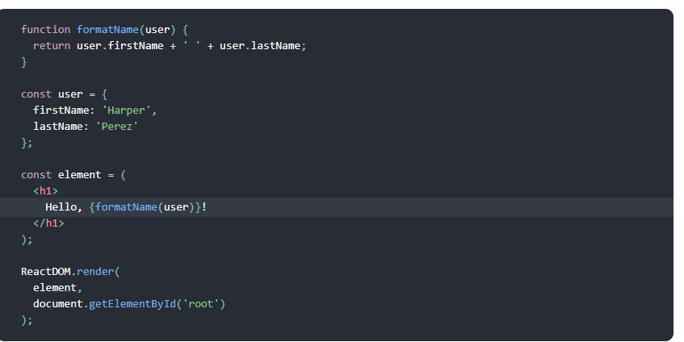
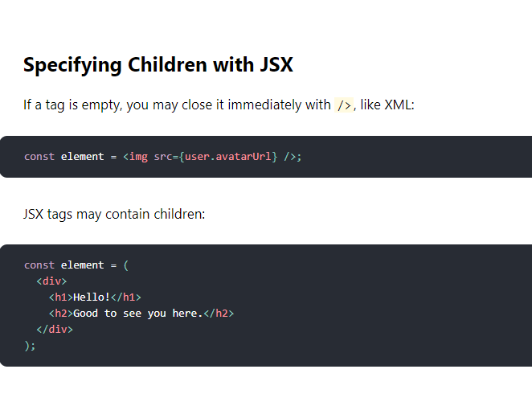
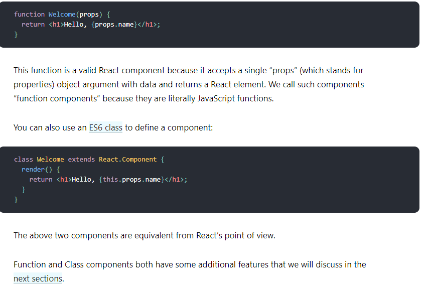

# React 
React. js is an open-source JavaScript library that is used for building user interfaces specifically for single-page applications. It's used for handling the view layer for web and mobile apps. React also allows us to create reusable UI components.

# Introducing JSX
 is called JSX, and it is a syntax extension to JavaScript. We recommend using it with React to describe what the UI should look like. JSX may remind you of a template language, but it comes with the full power of JavaScript.
 

 # Specifying Attributes with JSX
 const element = < div tabIndex="0"></ div>;

 

 # Rendering an Element into the DOM
Let’s say there is a < div> somewhere in your HTML file:

< div id="root"></ div>
 **We call this a “root” DOM node because everything inside it will be managed by React DOM.**

Applications built with just React usually have a single root DOM node. If you are integrating React into an existing app, you may have as many isolated root DOM nodes as you like.

To render a React element into a root DOM node, pass both to ReactDOM.render():

const element = < h1>Hello, world</ h1>;
ReactDOM.render(element, document.getElementById('root'));

# Components and Props

