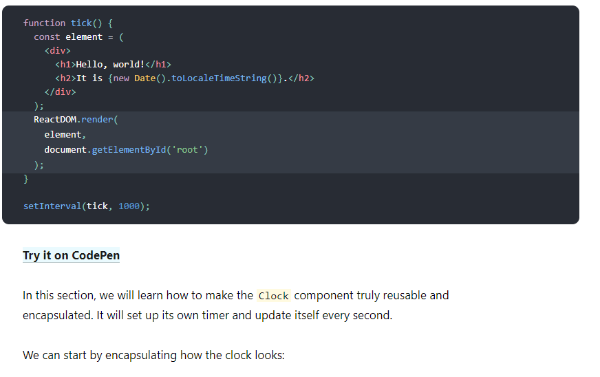
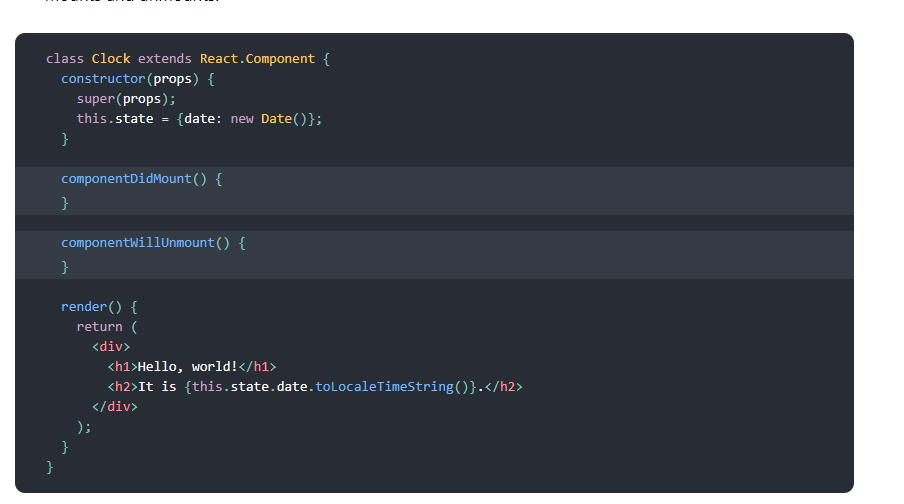
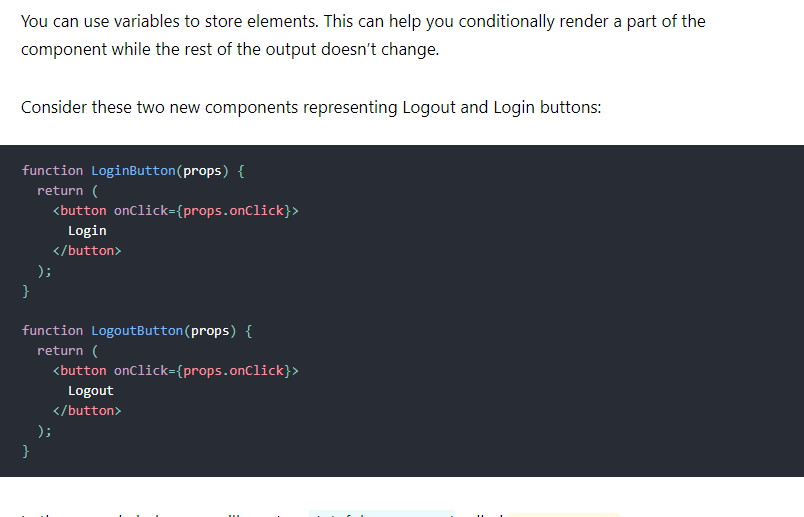
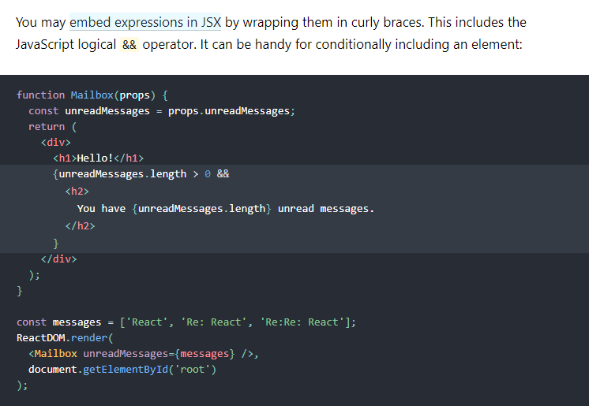
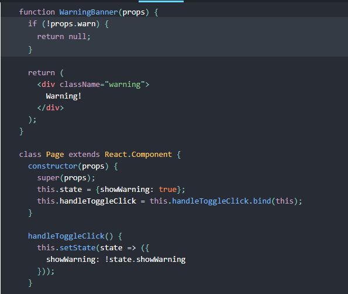
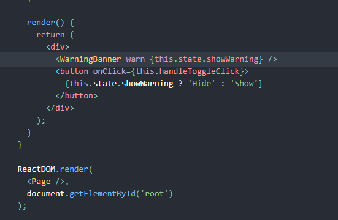

# State and Lifecycle
  We call ReactDOM.render() to change the rendered output:**

# Converting a Function to a Class
 we can convert a function component like Clock to a class in five steps:

* Create an ES6 class, with the same name, that extends React.Component.
* Add a single empty method to it called render().
* Move the body of the function into the render() method.
* Replace props with this.props in the render() body.
* Delete the remaining empty function declaration.

 # Adding Lifecycle Methods to a Class
* In applications with many components, it’s very important to free up resources taken by the components when they are destroyed.

* We want to set up a timer whenever the Clock is rendered to the DOM for the first time. This is called “mounting” in React.

* We also want to clear that timer whenever the DOM produced by the Clock is removed. This is called “unmounting” in React.

* We can declare special methods on the component class to run some code when a component mounts and unmounts:

# Handling Events
Handling events with React elements is very similar to handling events on DOM elements. There are some syntax differences:

React events are named using camelCase, rather than lowercase.
With JSX you pass a function as the event handler, rather than a string.

 * For example, the HTML:

< button onclick="activateLasers()">
  Activate Lasers
</ button>
* is slightly different in React:

< button onClick={activateLasers}>
  Activate Lasers
</ button>

When using React, you generally don’t need to call addEventListener to add listeners to a DOM element after it is created. Instead, just provide a listener when the element is initially rendered.

# Conditional Rendering
In React, you can create distinct components that encapsulate behavior you need. Then, you can render only some of them, depending on the state of your application.

Conditional rendering in React works the same way conditions work in JavaScript. Use JavaScript operators like if or the conditional operator to create elements representing the current state, and let React update the UI to match them.

# Element Variables

# Inline If with Logical && Operator

# Preventing Component from Rendering
In rare cases you might want a component to hide itself even though it was rendered by another component. To do this return null instead of its render output.

