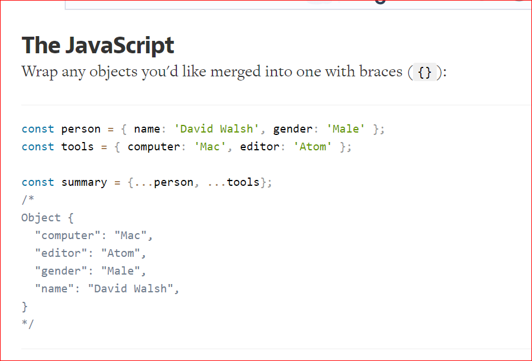

# Lifting State Up

Lifting up the State: every component in React has its own state. Because of this sometimes data can be redundant and inconsistent. So, by Lifting up the state we make the state of the parent component as a single source of truth and pass the data of the parent in its children.

## what does .map() do ?
map() function returns a map object(which is an iterator) of the results after applying the given function to each item of a given iterable (list, tuple ..) 
fun : It is a function to which map passes each element of given iterable.

## If I want to loop through an array and display each value in JSX, how do I do that in React?
const elements = [] //..some array const items = [] for (const [index, value] of elements. entries()) { items. ...
render() { const elements = ['one', 'two', 'three']; const items = [] for (const [index, value] of elements. ...
render: function() { const elements = ['one', 'two', 'three']; return ( <ul> {elements.

# What is the purpose of a key?
Keys help React identify which items have changed, are added, or are removed. Keys should be given to the elements inside the array to give the elements a stable identity: Example: const numbers = [1, 2, 3, 4, 5]; const listItems = numbers.

## Keys
Keys help React identify which items have changed, are added, or are removed. Keys should be given to the elements inside the array to give the elements a stable identity

# How to Use the Spread Operator (…) in JavaScript
## what is spread operator ?
The spread operator is a new addition to the set of operators in JavaScript ES6. It takes in an iterable (e.g an array) and expands it into individual elements. The spread operator is commonly used to make shallow copies of JS objects. Using this operator makes the code concise and enhances its readability.
## what does spread operator do ?
* passing props
* Generating multiple component instances with common props.
* Setting the state with dynamic key name.
* Adding a single item to the start or the end of an array.
* Stripping properties using destructuring.
Conclusion.

