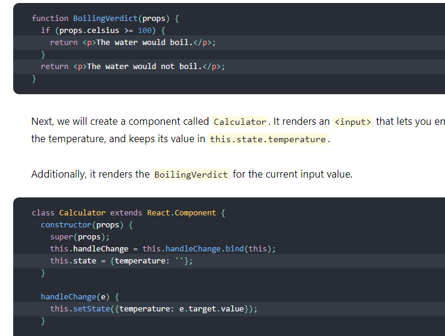
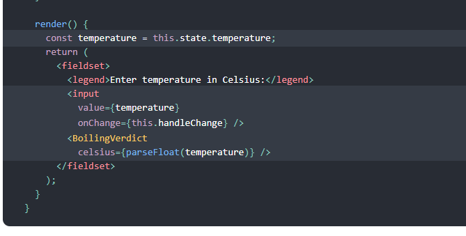
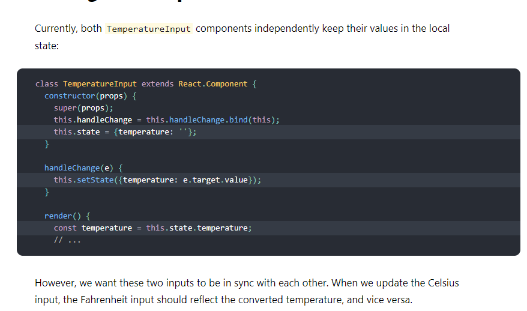

# Lifting State Up
In React, sharing state is accomplished by moving it up to the closest common ancestor of the components that need it. This is called “lifting state up”. We will remove the local state from the TemperatureInput and move it into the Calculator instead.

# Adding a Second Input
Our new requirement is that, in addition to a Celsius input, we provide a Fahrenheit input, and they are kept in sync.

We can start by extracting a TemperatureInput component from Calculator. We will add a new scale prop to it that can either be "c" or "f"

# Writing Conversion Functions
 * function toCelsius(fahrenheit) {
  return (fahrenheit - 32) * 5 / 9;
}

* function toFahrenheit(celsius) {
  return (celsius * 9 / 5) + 32;
}

**These two functions convert numbers**
we need a function that takes a string temperature and a converter function as arguments and returns a string.
* We will use it to calculate the value of one input based on the other input.

It returns an empty string on an invalid temperature, and it keeps the output rounded to the third decimal place:

* function tryConvert(temperature, convert) {
  const input = parseFloat(temperature);
  if (Number.isNaN(input)) {
    return '';
  }
 * const output = convert(input);
  const rounded = Math.round(output * 1000) / 1000;
  return rounded.toString();
}

For example, tryConvert('abc', toCelsius) returns an empty string, and

# Lifting State Up

# Lists and Keys
Rendering Multiple Components
* we can build collections of elements and include them in JSX using curly braces {}.

* Below, we loop through the numbers array using the JavaScript map() function. We return a <li> element for each item. Finally, we assign the resulting array of elements to listItems:

* const numbers = [1, 2, 3, 4, 5];
const listItems = numbers.map((number) =>
  <li>{number}</li>
);
We include the entire listItems array inside a <ul> element, and render it to the DOM:

* ReactDOM.render(
  <ul>{listItems}</ul>,
  document.getElementById('root')
);

## Keys
Keys help React identify which items have changed, are added, or are removed. Keys should be given to the elements inside the array to give the elements a stable identity

## Extracting Components with Keys
function ListItem(props) {
  // Correct! There is no need to specify the key here:
  return < li>{props.value}</ li>;
}

function NumberList(props) {
  const numbers = props.numbers;
  const listItems = numbers.map((number) =>
    // Correct! Key should be specified inside the array.
    < ListItem key={number.toString()} value={number} />
  );
  return (
    < ul>
      {listItems}
    </ ul>
  );
}

const numbers = [1, 2, 3, 4, 5];
ReactDOM.render(
  < NumberList numbers={numbers} />,
  document.getElementById('root')
);